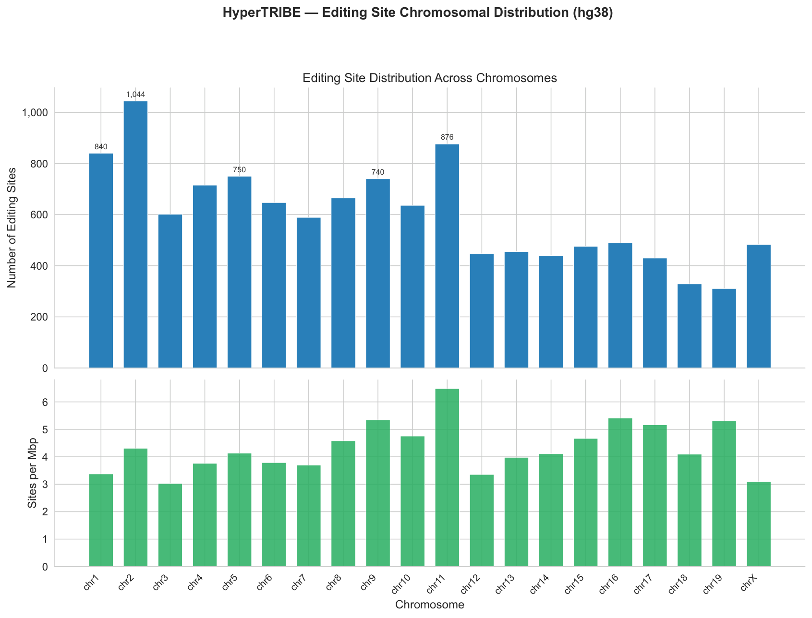
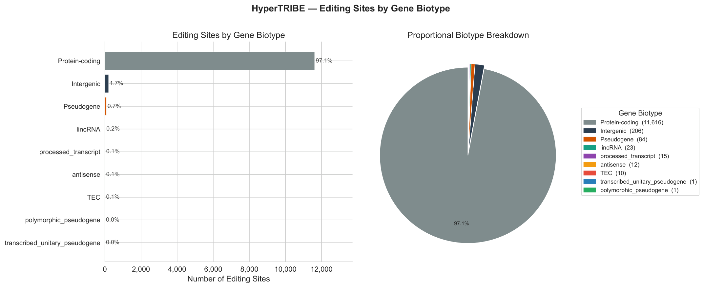
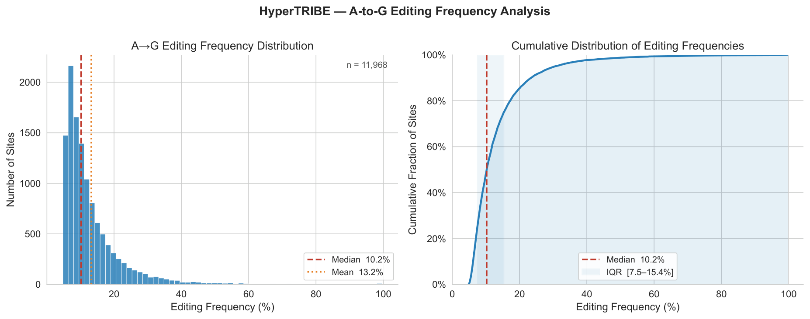

# Example Output Figures

Real diagnostic plots produced by this pipeline's `scripts/plot_*.py` steps,
included here as worked examples of what a completed run generates. All
three were generated by `generate_report.py`'s plotting stage on
2026-07-29, using the current (post-fix) `call_editing_sites_parallel.py`.

Source dataset: an in-house IGF2BP2 (IMP2) knockout HyperTRIBE experiment
(mouse, mm10) — chosen as the example because it's a clean, representative
run with nothing sensitive/unpublished in the diagnostic-level output
(chromosome distribution, gene biotype, editing frequency). It is **not**
representative of every project this pipeline has been used for; some
downstream comparison figures (target-gene overlaps, gene tracks, etc.)
are excluded from this repo because they belong to in-progress manuscripts.

## `plot_chromosome_distribution.py`

Editing sites per chromosome, raw counts and sites/Mbp. Vector source:
[`chromosome_distribution.pdf`](chromosome_distribution.pdf).

> **Known issue:** the plot title hardcodes `(hg38)` regardless of the
> genome build actually used — the run above is mouse/mm10 (visible from
> the chr1–19+X axis, no chr20–22), so the title is simply wrong here. The
> script doesn't currently thread the configured genome build through to
> the plot title. Not fixed in this push; flagged for a follow-up.

## `plot_biotype_distribution.py`

Editing sites broken down by gene biotype (protein-coding, intergenic,
pseudogene, etc.), bar + pie. Vector source:
[`gene_biotype_distribution.pdf`](gene_biotype_distribution.pdf).

## `plot_editing_distribution.py`

A→G editing-frequency histogram and cumulative distribution across all
filtered sites. Vector source:
[`editing_frequency_distribution.pdf`](editing_frequency_distribution.pdf).

---

Other plotting scripts in `scripts/` (`plot_gene_tracks.py`,
`plot_target_overlap.py`, `plot_editing_changes.py`,
`plot_splice_motifs.py`, `plot_mutant_vs_wt.py`, etc.) produce
comparison-level figures (two-condition overlaps, gene-track browsers,
splice-motif enrichment). No example outputs are included for those here
since the only runs available belong to specific research projects that
haven't been cleared for public posting — see script docstrings/`--help`
for usage.
